# Flutter Baby Tracker Application Design

## 1. Overview

The Flutter Baby Tracker is a comprehensive mobile application designed for mothers to track their baby's development, health, and milestones from birth to 5 years old. The application provides scientific-based recommendations, health tracking, cultural traditions, and optional astrology features.

### Key Features
- Offline-first architecture with minimal online requirements
- Daily recommendations for babies (0-3 years), weekly for 3-5 years
- Comprehensive health tracking (vaccines, sleep, nutrition, percentiles)
- Cultural traditions from Turkey and worldwide
- Optional astrology compatibility features
- Modern, user-friendly interface
- Future Google Ads integration (banner ads only)

### Target Platforms
- Android (primary)
- iOS (cross-platform Flutter support)

## 2. Technology Stack & Dependencies

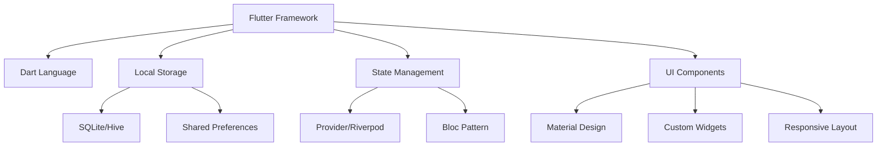

### Core Dependencies
- **flutter**: Framework
- **sqflite**: Local database
- **provider/riverpod**: State management
- **shared_preferences**: Simple data storage
- **intl**: Internationalization
- **charts_flutter**: Data visualization
- **image_picker**: Photo capture
- **permission_handler**: Device permissions
- **path_provider**: File system access

### Future Dependencies
- **google_mobile_ads**: Advertisement integration

## 3. Application Architecture

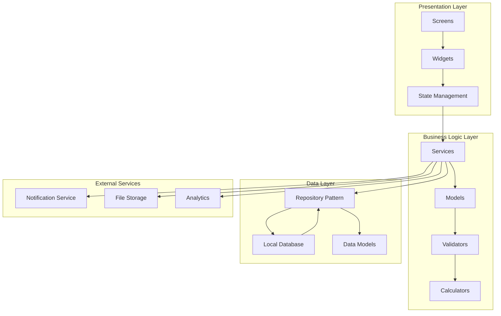

## 4. Data Architecture & Models

### Core Data Models

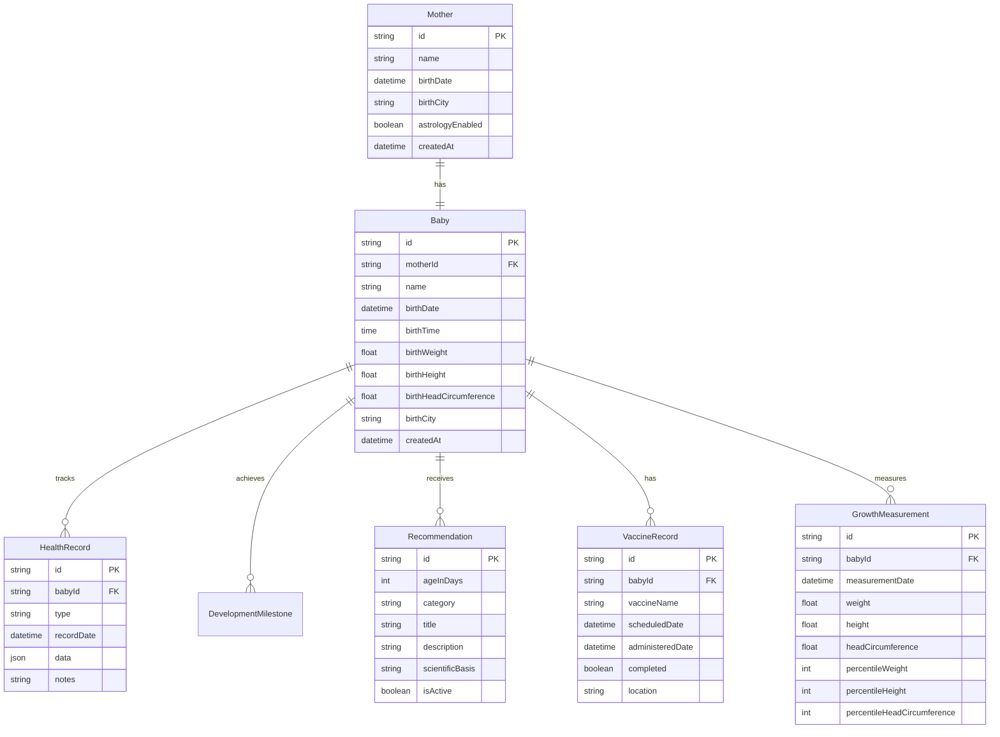

### Recommendation Categories

| Category | Description | Age Range |
|----------|-------------|-----------|
| Development | Physical and cognitive milestones | 0-5 years |
| Nutrition | Feeding guidelines and food introduction | 0-5 years |
| Sleep | Sleep patterns and recommendations | 0-5 years |
| Activities | Age-appropriate games and exercises | 0-5 years |
| Books | Literature recommendations | 0-5 years |
| Music | Musical development activities | 0-5 years |
| Toys | Educational toy suggestions | 0-5 years |
| Safety | Safety precautions and childproofing | 0-5 years |

## 5. Core Features Architecture

### 5.1 Registration & Onboarding Flow

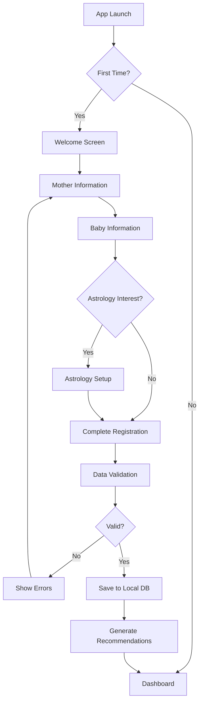

**Registration Data Collection:**
- Mother: Name, birth date (optional), birth city (optional)
- Baby: Name, birth date, birth time, weight, height, head circumference, birth city
- Astrology: Optional mother's birth information for compatibility

### 5.2 Daily Recommendations System

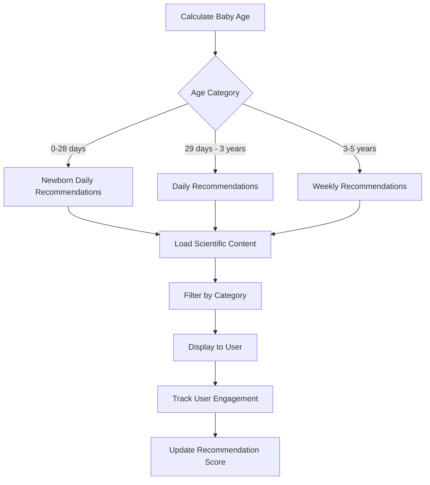

**Recommendation Structure:**
- **Title**: Brief, actionable headline
- **Description**: Detailed explanation (150-300 words)
- **Scientific Basis**: Reference to studies/organizations
- **Category**: Development, nutrition, sleep, etc.
- **Age Specificity**: Exact day/week targeting

### 5.3 Health Tracking System

```mermaid
flowchart TD
    A[Health Dashboard] --> B[Growth Tracking]
    A --> C[Vaccine Schedule]
    A --> D[Sleep Monitoring]
    A --> E[Nutrition Tracking]
    A --> F[Milestone Tracking]
    
    B --> B1[Weight Measurements]
    B --> B2[Height Measurements]
    B --> B3[Head Circumference]
    B --> B4[Percentile Calculations]
    
    C --> C1[Turkish Ministry Schedule]
    C --> C2[WHO Schedule]
    C --> C3[Reminder System]
    
    D --> D1[Sleep Duration]
    D --> D2[Sleep Quality]
    D --> D3[Sleep Patterns]
    
    E --> E1[Breastfeeding Log]
    E --> E2[Formula Tracking]
    E --> E3[Solid Food Introduction]
    
    F --> F1[Motor Skills]
    F --> F2[Cognitive Development]
    F --> F3[Social Skills]
    F --> F4[Language Development]
```

### 5.4 Cultural Traditions Module

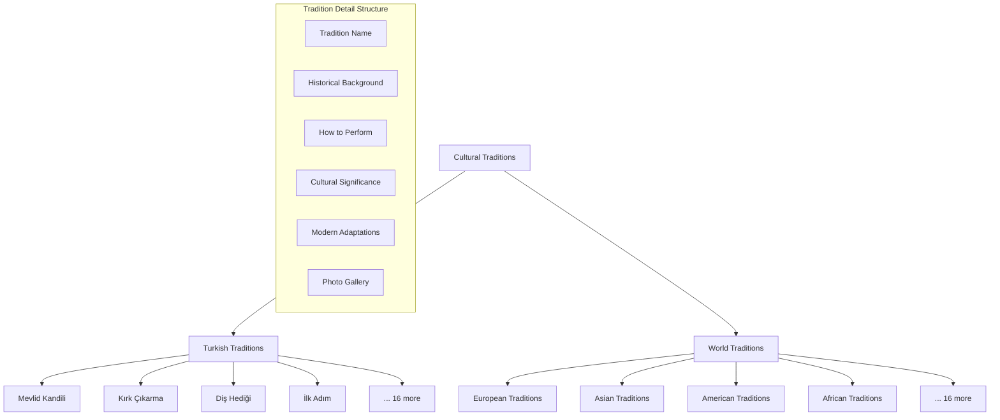

### 5.5 Astrology Module (Optional)

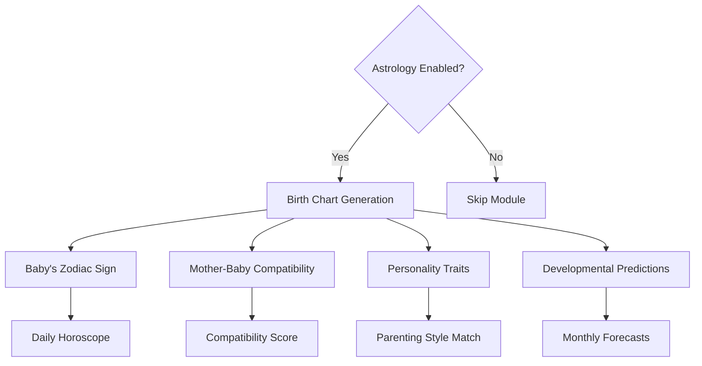

## 6. User Interface Architecture

### 6.1 Navigation Structure

```mermaid
flowchart TD
    A[Bottom Navigation] --> B[Dashboard]
    A --> C[Health]
    A --> D[Recommendations]
    A --> E[Traditions]
    A --> F[Profile]
    
    B --> B1[Baby Overview]
    B --> B2[Today's Tips]
    B --> B3[Quick Actions]
    B --> B4[Growth Chart Preview]
    
    C --> C1[Growth Tracking]
    C --> C2[Vaccines]
    C --> C3[Sleep Log]
    C --> C4[Nutrition]
    C --> C5[Milestones]
    
    D --> D1[Daily/Weekly Tips]
    D --> D2[Categories]
    D --> D3[Saved Recommendations]
    D --> D4[Search]
    
    E --> E1[Turkish Traditions]
    E --> E2[World Traditions]
    E --> E3[Favorites]
    E --> E4[Search Traditions]
    
    F --> F1[Baby Settings]
    F --> F2[Mother Settings]
    F --> F3[Astrology]
    F --> F4[Notifications]
    F --> F5[Data Export]
```

### 6.2 Screen Components

| Screen | Primary Components | Key Features |
|--------|-------------------|--------------|
| Dashboard | Summary cards, Quick actions, Progress indicators | Real-time baby age, Today's tips, Growth summary |
| Health Tracking | Input forms, Charts, Timeline | Measurement logging, Percentile visualization |
| Recommendations | Card list, Filter chips, Search | Category filtering, Bookmark system, Progress tracking |
| Traditions | Grid view, Detail modal, Search | Rich media content, Favorites system |
| Profile | Settings form, Data visualization | Privacy controls, Data management |

## 7. Offline Architecture & Data Synchronization

### 7.1 Offline-First Design

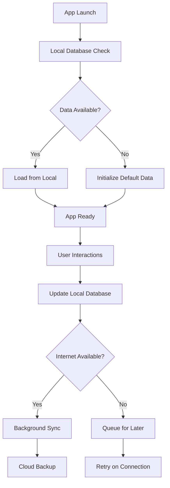

### 7.2 Data Storage Strategy

| Data Type | Storage Method | Size Estimate | Sync Required |
|-----------|---------------|---------------|---------------|
| User Profile | SQLite | < 1KB | Optional |
| Baby Information | SQLite | < 5KB | Optional |
| Health Records | SQLite | ~100KB/year | Optional |
| Recommendations | Embedded/SQLite | ~50MB | No |
| Cultural Traditions | Embedded/SQLite | ~100MB | No |
| Astrology Data | SQLite | < 10KB | Optional |
| App Settings | Shared Preferences | < 1KB | No |

## 8. Scientific Content Integration

### 8.1 Content Sources & Validation

**Primary Sources:**
- Turkish Ministry of Health (Türkiye Sağlık Bakanlığı)
- World Health Organization (WHO)
- Turkish Pediatric Association (Türk Pediatri Derneği)
- American Academy of Pediatrics (AAP)
- European Academy of Paediatrics (EAP)

**Research Databases:**
- PubMed/MEDLINE
- Cochrane Library
- Medscape
- Elsevier journals
- Nature publications

**Content Validation Process:**
1. Source credibility verification (impact factor > 2.0)
2. Peer review status confirmation
3. Publication date relevance (< 5 years for guidelines)
4. Cultural adaptation for Turkish population
5. Expert pediatrician review

### 8.2 Recommendation Algorithm

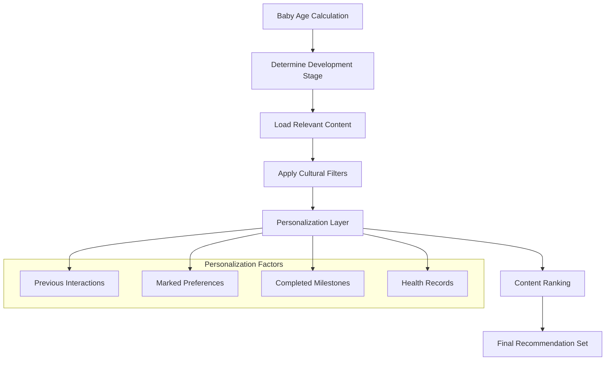

## 9. Testing Strategy

### 9.1 Unit Testing
- **Model validation**: Data integrity, business logic
- **Calculator functions**: Percentile calculations, age computations
- **Repository pattern**: Data access layer testing
- **Service layer**: Business logic validation

### 9.2 Widget Testing
- **Screen rendering**: UI component display
- **User interactions**: Button taps, form submissions
- **Navigation flow**: Screen transitions
- **State management**: Provider/Bloc state changes

### 9.3 Integration Testing
- **Database operations**: CRUD operations validation
- **File system access**: Data import/export
- **Notification system**: Reminder functionality
- **Offline capabilities**: No-network scenarios

### 9.4 User Acceptance Testing
- **Onboarding flow**: Complete registration process
- **Daily usage patterns**: Typical user workflows
- **Data accuracy**: Health calculations verification
- **Performance testing**: App responsiveness on target devices

## 10. Performance Optimization

### 10.1 Memory Management
- Lazy loading for large datasets
- Image optimization and caching
- Widget disposal in navigation
- Background process management

### 10.2 Database Optimization
- Indexed queries for frequent searches
- Batch operations for bulk data
- Database schema optimization
- Regular cleanup of old data

### 10.3 UI Performance
- Widget tree optimization
- Custom painter for complex graphics
- Async operations for heavy calculations
- Progressive image loading

## 11. Security & Privacy

### 11.1 Data Protection
- Local data encryption (AES-256)
- Secure storage for sensitive information
- No cloud storage by default
- Optional encrypted backup

### 11.2 Privacy Controls
- Granular data sharing permissions
- Data export functionality
- Complete data deletion option
- Transparent privacy policy

### 11.3 Child Safety
- No external communication without consent
- Offline-first design for data protection
- Parental control features
- Safe content filtering

## 12. Future Enhancements

### 12.1 Phase 2 Features
- Email authentication and OAuth integration
- Cloud synchronization across devices
- Multi-language support (English, German, French)
- Advanced analytics and insights

### 12.2 Phase 3 Features
- Healthcare provider integration
- AI-powered personalized recommendations
- Community features (optional)
- Apple Health / Google Fit integration

### 12.3 Monetization Integration
- Google Ads SDK integration
- Banner advertisements at app bottom
- Non-intrusive ad placement
- Premium ad-free version option